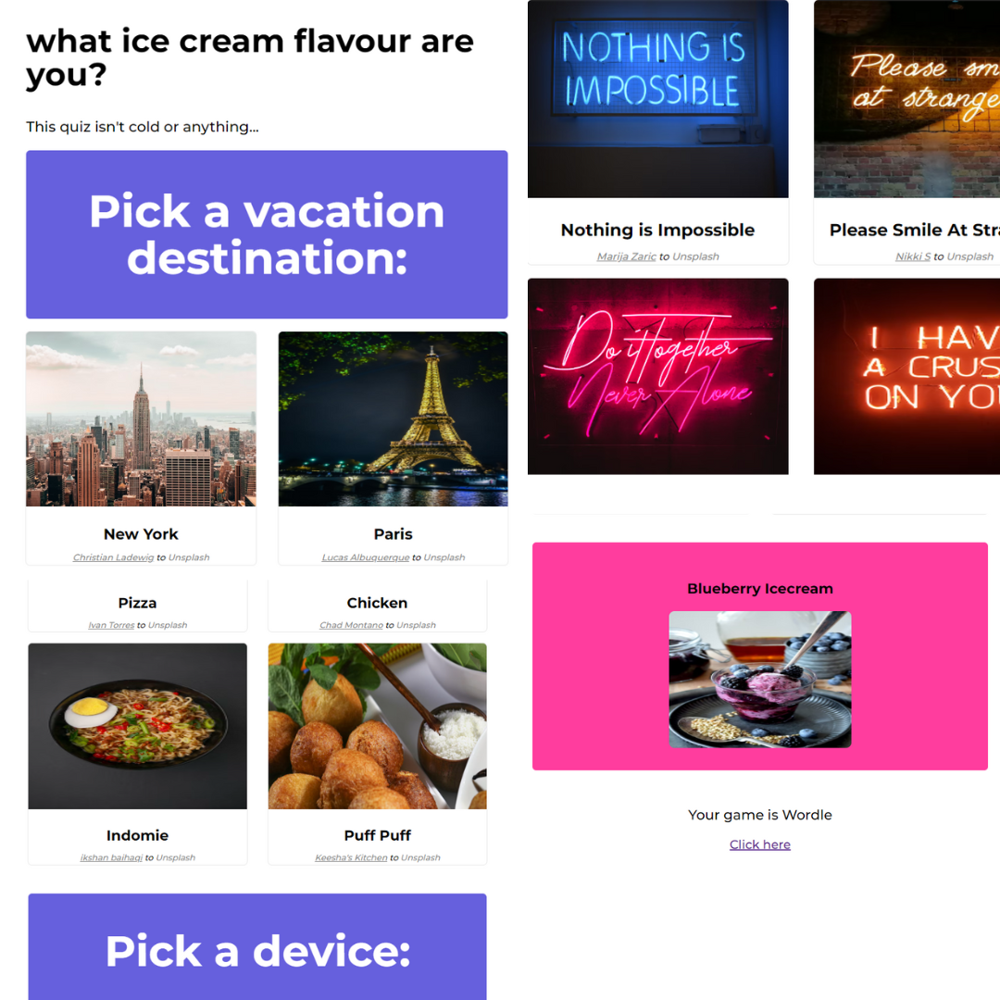

# Buzzfeed Clone
A buzzfeed clone I made with a few changes. The user picks their answer from a range of 10 questions and gets told what kind of icecream flavour they are and are then redirected to play a game based on their icecream flavour. 

## Table of contents

- [Overview](#overview)
  - [Screenshot](#screenshot)
  - [Links](#links)
- [My process](#my-process)
  - [Built with](#built-with)
  - [What I learned](#what-i-learned)
  

## Overview

### Screenshot

A collage I designed to show what the quiz looks like

### Links

- Answer the quiz questions and see what flavour of icecream you are [here](https://onanuviie.github.io/buzzfeed-clone-js/)

## My process

### Built with

- Semantic HTML5 markup
- CSS custom properties
- Flexbox
- Javascript event handlers
- Javascript Array Methods

### What I learnt

I learnt how to move through sections of the questions once the user pickes an answer with "location.href" in javascript and I also learnt how to incorporate online images in javascript.
